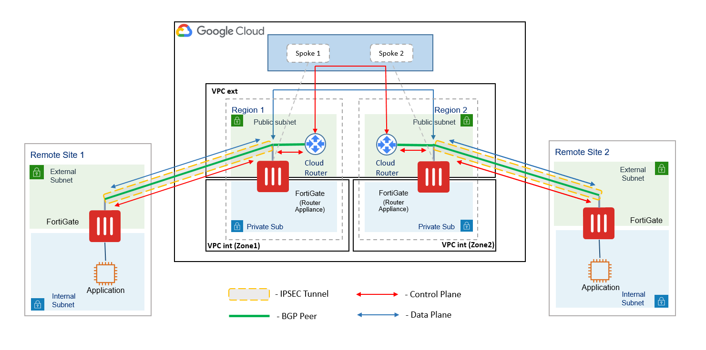

# FortiGate SD-WAN Transit Routing with Google NCC

## Introduction

An SD-WAN transit routing scenario with Google Network Connectivity Center (NCC) allows users to route data and exchange BGP routing information between two or more remote sites over the Google Cloud Platform Infrastructure.

Implementation is done by creating the NCC HUB and an endpoint (Spoke) for each remote site. In order to reduce Network latency, the Spoke is deployed in a Google Cloud region that is located geographically closest to the remote site for which it is created.

The Script Included in this Repository Deploys Internal/External VPCs, NCC Hub, Spoke, Cloud Router and Fortigate-VM (Router Appliance) .
- Deployed items are pre-configured with the variables that are read from the parameter file `fortigate-ncc-param-zone1.json`.
- ```
-	Script Deploys a PAYG instance. List of the Order types can be found at [Fortigate Cloud VM Licensing Order Types](https://docs.fortinet.com/document/fortigate-public-cloud/7.0.0/gcp-administration-guide/451056/order-types)


## Design

<p align="center">
  <a href="images/"></a>
</p


The provided script deploys VPC external/internal and all the necessary components in a Single Zone. The script has to be run again with changed variables in the fortigate-ncc-param-zone1.json file to deploy the components in the second zone and add them to the same HUB.


## Pre-requisites:

1) ***Staging Server*** : _A Linux environment can be used as a staging server. Alternatively Google Cloud CLI can also be used to run the script._
- These must be installed on the runtime:  googleapiclient, google.oauth2, google.auth, google.cloud.
- ```
- The packages PyJWT and cryptography must be installed using pip.

2) ***Authentication***: _Google Cloud Service Account._
	- Create a Google Cloud Service account with Owner Rights.
	- Create a Key in json format and copy it to your staging server (where your Python program will run).

3) ***Cloud Storage Bucket:***
	- Create a Storage Bucket on GCP.
	- Edit the Parameters in "fortigate-ncc-param-zone1.json" as required. Template for this is provided in the ***fortigate-ncc-param-zone1.json.example*** file
	- Upload file to the bucket.

		Files Required on the staging server (locally) : **deploy-fortigate-ncc.py , JSON key created in step2**

		Files Required on the Cloud Bucket : **fortigate-ncc-param-zone1.json**
	
## Execution

On the Staging server, Run the following command :
	
	python3 deploy-fortigate-ncc.py /$path/apikey.json storage-bucket-name1 fortigate-ncc-param-zone1.json
		
-	Please ensure to use the absolute path for the ApiKey
	

## Deployment Specifications

The Python scritp deploys different resources and it is required to have the required access rights and quota in your GCP subscription to deploy the resources.

- The template will deploy n1-standard-4 VMs for this architecture. Other VM instances are supported as well with a minimum of 2 NICs. A list can be found [here](https://docs.fortinet.com/document/fortigate-public-cloud/7.0.0/gcp-administration-guide/204792/models)
- Licenses for Fortigate : The Given script deploys a PAYG image.
  - PAYG : This license is automatically generated during the deployment of the FortiGate systems.


Note: this solution has been tested in Python 3.7.7 and 3.8.5 runtime environments


## Support
Fortinet-provided scripts in this and other GitHub projects do not fall under the regular Fortinet technical support scope and are not supported by FortiCare Support Services.
For direct issues, please refer to the [Issues](https://github.com/fortinet/fortigate-terraform-deploy/issues) tab of this GitHub project.
For other questions related to this project, contact [github@fortinet.com](mailto:github@fortinet.com).

## License
[License](https://github.com/fortinet/fortigate-gcp-ncc/blob/main/LICENSE) © Fortinet Technologies. All rights reserved.
